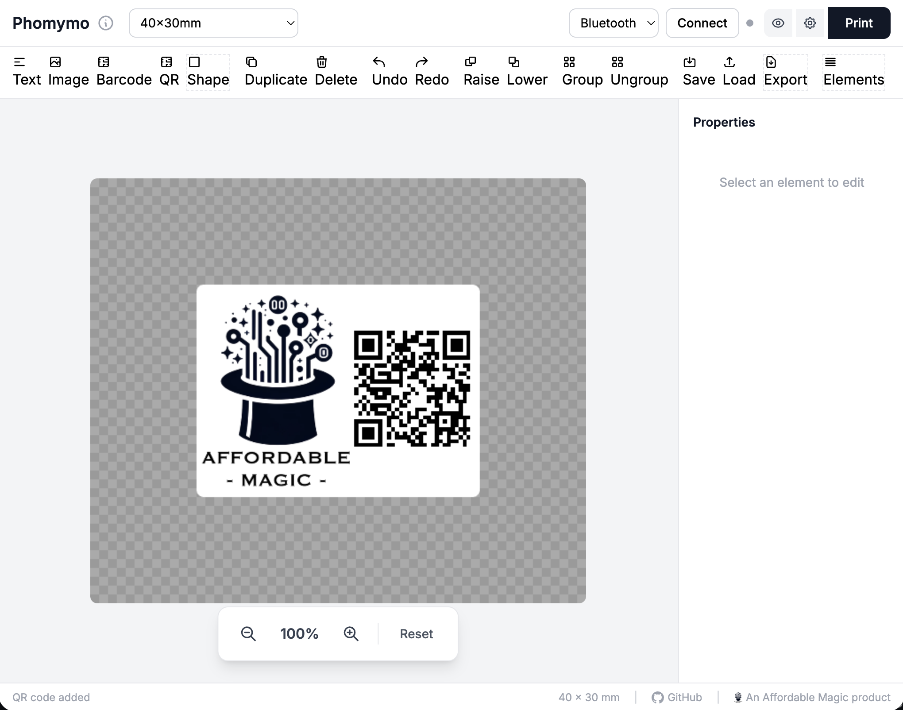
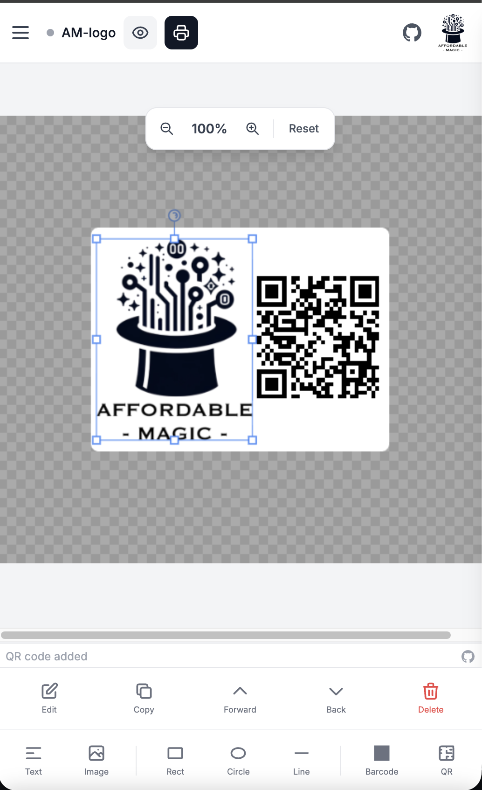

# BLE Label Hub

A browser-based thermal label designer and driver. Design labels with text, barcodes, QR
codes, images, and shapes, then print directly to BLE/USB thermal printers — no app, no drivers.
Runs entirely client-side. Originally built for the **Jadens JD-468BT**, now supports Niimbot,
Phomemo, and many M-/D-series, P12/A30 tape, and TSPL shipping printers.

<p>
  
  
</p>

## Quick start

```bash
npm start
# serves src/web on http://localhost:3001 — open in Chrome or Edge
```

1. Open the app in Chrome/Edge (desktop or Android).
2. Set the **connection-type dropdown** (next to Connect) to match your printer:
   **Bluetooth**, **Niimbot**, or **USB** — see [Connecting](#connecting).
3. Click **Connect** and pick your printer from the browser's device picker.
4. Design your label and click **Print**.

**Requires** a Chromium browser (Chrome, Edge, Opera). Web Bluetooth is **not** available in
Firefox or Safari, and **not** on iOS. Android Chrome is supported. Production hosting needs
HTTPS; `localhost` works for development.

## Install as a mobile app (PWA)

BLE Label Hub is a Progressive Web App. On Android Chrome, open the site and choose
**Install app** / **Add to Home screen** to run it full-screen and offline, like a native app.
When installed, the About dialog (ℹ️) shows an **Open Desktop Version** link.

## Connecting

The **connection-type dropdown is the single switch** that decides how the app talks to the
printer. Print Settings does *not* change it.

| Dropdown | Use for | Protocol |
|----------|---------|----------|
| **Bluetooth** | Jadens JD-468BT, Phomemo, M-series, D-series, P12/A30, TSPL shipping | ESC/POS / TSPL over BLE |
| **Niimbot** | NIIMBOT printers (B1, B21, D11, D110, B18, …) | NiimBlueLib protocol |
| **USB** | Printers connected by USB cable, where supported | WebUSB |

Picking the wrong mode is the most common failure: a Niimbot on "Bluetooth" (or a Jadens on
"Niimbot") will pair in the picker but fail to connect/print. The **Connect** button becomes
**Disconnect** once connected. The footer shows the connected printer's make, model, and firmware.

> **Bluetooth allows one connection at a time.** If a printer won't connect even when you're
> next to it, it's usually still linked to its phone app or another device — close that, toggle
> Bluetooth off/on, power-cycle the printer, and retry.

## Features

- **Design elements** — Text (system fonts, sizes, styles, alignment, background), images
  (scale, aspect lock), barcodes (Code128, EAN-13, UPC-A, Code39), QR codes, and shapes
  (rectangle, ellipse, triangle, line) with solid, dithered-grayscale, and stroke fills.
- **Editing** — Drag/resize/rotate, multi-select (Shift+click), grouping (Ctrl/Cmd+G),
  undo/redo, keyboard nudge, layer order, clipboard image paste (Ctrl/Cmd+V), Move tool.
- **Image tuning for thermal** — Brightness, contrast, a one-click **Black & White** toggle for
  pasted color images, and selectable dithering (Floyd-Steinberg, Atkinson, ordered, threshold).
- **Label sizes** — Per-printer presets, round labels, custom dimensions, and multi-label rolls.
  The correct **default size auto-applies** when you connect or pick a printer (e.g. Niimbot B1 → 50×30 mm).
- **Templates & batch printing** — `{{FieldName}}` placeholders, CSV import, preview grid, and
  batch printing with progress.
- **Instant expressions** — Print-time values via `[[date]]`, `[[time]]`, `[[datetime]]`, or
  `[[date|MM/DD/YYYY]]`, in text, barcodes, and QR codes.
- **Print preview** — Toggle dither preview to see the exact monochrome thermal output.
- **Custom printer definitions** — Add/override width, DPI, density, and BLE name patterns.
- **PWA** — Installable and offline-capable on mobile.

## How it works

Designs are laid out on an HTML Canvas, rendered at the printer's resolution, converted to
grayscale, dithered, and packed to a **1-bit bitmap**, then streamed to the printer. Thermal
printers are raster devices, so all output is monochrome regardless of on-screen color. Niimbot
printers use their own protocol (via NiimBlueLib); everything else uses ESC/POS or TSPL over BLE.

## Project structure

```
src/web/
├── index.html        UI markup + styles (Tailwind via CDN)
├── app.js            main controller (state, events, connect/print flow)
├── canvas.js         CanvasRenderer — draw, filters, raster + dither
├── printer.js        printer definitions + print() protocol dispatch
├── niimbot.js        NiimbotTransport (wraps NiimBlueLib)
├── ble.js / usb.js   BLE / USB transports
├── elements.js       element model + helpers
├── handles.js        resize/rotate handles
├── constants.js      label-size tables + BLE UUIDs
├── templates.js      template fields + CSV merge
├── storage.js        localStorage persistence
├── printers.json     built-in printer definitions
├── manifest.json     PWA manifest
├── sw.js             service worker (offline shell)
└── icons/            PWA icons
```

No build step — the browser loads the ES modules directly. Module imports are cache-busted with
`?v=` query strings; bump them on change if caching gets stale. See
[PROJECT_OVERVIEW.md](PROJECT_OVERVIEW.md) for architecture details and gotchas.

## Development

```bash
npm start          # copy vendor lib + serve on :3001
npm test           # Playwright tests
npm run vendor     # copy NiimBlueLib into src/web/vendor
```

Syntax-check the ES modules (plain `node --check` fails on the `?v=` import URLs):

```bash
node --input-type=module --check < src/web/app.js
```

## Troubleshooting

- **Printer pairs but won't connect** — it's likely held by its phone app (BLE = one connection).
  Close it, toggle Bluetooth, power-cycle, retry.
- **Connects but the printer light stays red** — the green dot is the BLE link; a Niimbot also
  needs its handshake to finish (watch the status bar for "Printer handshake OK").
- **"Not a Niimbot printer" / "no suitable characteristic"** — wrong connection-type dropdown.
- **Printer not in the picker** — it's filtered to known name prefixes; Shift+click **Connect**
  to show all Bluetooth devices.

## Credits

Built on the work of these projects:

- [transcriptionstream/phomymo](https://github.com/transcriptionstream/phomymo) — Phomemo thermal
  printing foundation.
- [a-rbsn/phomymo-pwa](https://github.com/a-rbsn/phomymo-pwa) — PWA structure and approach.
- [labbots/NiimPrintX](https://github.com/labbots/NiimPrintX) — reference for Niimbot BLE support.

Niimbot protocol support uses [NiimBlueLib](https://github.com/MultiMote/niimbluelib).
